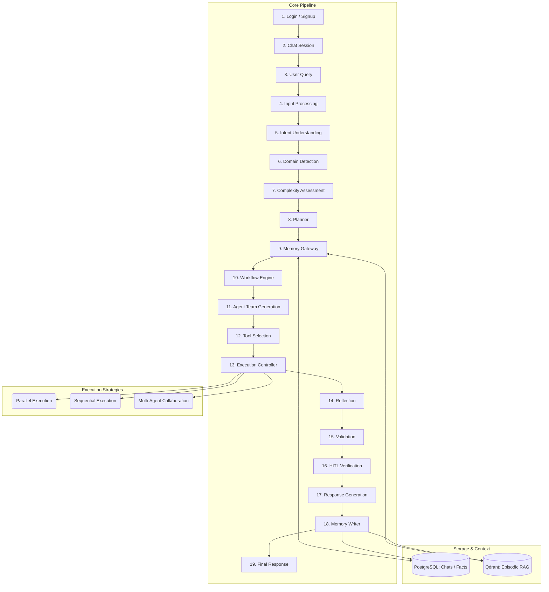
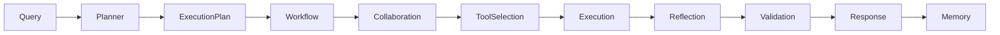
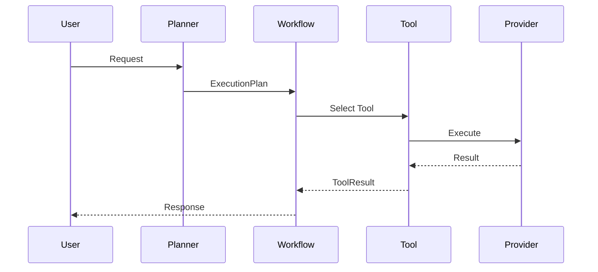

# Nexus AI (Universal Problem Solving System)

> **An Enterprise-Grade Multi-Agent AI Platform for Universal Task Automation**

Nexus AI (UPSS) is a modular, enterprise-grade agentic AI platform designed to solve complex, multi-step tasks through strategic planning, long-term cognitive memory, workflow orchestration, multi-agent collaboration, dynamic tool selection, execution control, reflection, validation, and human-in-the-loop (HITL) approval.

---

## 🚀 Core Features

*   **19-Phase Orchestration Pipeline**: End-to-end routing from authentication, complexity assessment, and planning to dynamic execution, validation, reflection, and memory writing.
*   **Cognitive Memory Layer (Phase 9 & 18)**:
    *   *Short-Term (Conversational)*: Full session context windowing tracked in PostgreSQL.
    *   *Long-Term Fact Memory*: Dynamic regex-based fact extraction (e.g., names, locations, likes) saved to PostgreSQL and recalled during greetings and personalization.
    *   *Episodic Milestone Memory*: Structured task events and user actions embedded using local Hugging Face `BAAI/bge-m3` on CUDA GPU and indexed in Qdrant Vector DB.
*   **Dynamic Tool Selection & Execution (Phase 12 & 13)**:
    *   A crawl-based auto-discovery scanner that registers new Python tool instances at runtime.
    *   Asynchronous Execution Controller supporting parallel execution, dynamic capability matching, health tracking, and auto-abort loops on task failures.
*   **Fully Integrated Domain Agents**:
    *   *Travel Agent*: Day-by-day itinerary planners, train timetables, mock ticketing databases, and a multi-turn ticket booking state machine.
    *   *Calculator*: Safe sandboxed mathematical evaluations.
    *   *Search*: Web scrapers and internet search adapters.
    *   *Browser*: Dynamic HTML parsers and markdown text extractors.

---

## 📐 High-Level Architecture

The system coordinates agents, tools, databases, and LLM providers through a standard 19-phase pipeline:



---

## 🔄 Runtime Workflow



---

## 🧠 Core Component Specifications

### 1. Planner (Phase 8)
*   **Responsibilities**: Understand user intent, decompose tasks, create execution plans, define dependencies, and estimate execution strategy.
*   **Outputs**: `ExecutionPlan` containing `PlannerTask` lists, constraints, and success criteria.

### 2. Memory Layer (Phase 9 & 18)
*   **Responsibilities**: Coordinate user facts, conversation memory, and semantic RAG integration.
*   **Components**: Postgres-backed relational service, Qdrant-backed vector manager, and the Memory Writer pipeline.

### 3. Workflow Engine (Phase 10)
*   **Responsibilities**: Build and validate runtime task schedules.
*   **Components**: Workflow Builder, Scheduler, Dependency Resolver, and Sequential/Parallel Executors.

### 4. Multi-Agent Collaboration (Phase 11)
*   **Responsibilities**: Coordinate division of labor between specialized agents.
*   **Components**: Agent Registry, Agent Selector, Collaboration Manager, and Task Allocation protocols.

### 5. Tool Layer & Execution Lifecycle
The execution controller maps planner tasks to registered adapters through the following lifecycle:

```text
PlannerTask
      ↓
Capability Matcher
      ↓
Tool Matcher
      ↓
Tool Registry
      ↓
Tool Ranker
      ↓
Provider Selector
      ↓
Execution Controller
      ↓
Tool Manager
      ↓
Tool Executor
      ↓
Base Tool
      ↓
Provider Factory
      ↓
Provider
      ↓
Tool Result
```



---

## 🛠️ Technology Stack

| Layer | Technologies | Description |
|---|---|---|
| **Frontend** | HTML5, CSS3, JavaScript / React / Next.js | sleek dashboard, glassmorphism, responsive chat, React Flow |
| **Backend** | Python, FastAPI, SQLAlchemy ORM, AsyncIO, Pydantic | High-performance asynchronous API framework |
| **AI / Embeddings**| Gemini/OpenAI Ready, Hugging Face `BAAI/bge-m3` | Local vectorization with CUDA GPU acceleration |
| **Databases** | PostgreSQL, Redis, Qdrant Vector DB | Multi-tier persistence for SQL, cache, and vector indexes |
| **DevOps** | Docker, Nginx, Kubernetes, GitHub Actions | Containerization and CI/CD ready |
| **Monitoring** | Prometheus, Grafana, ELK, LangSmith | Log analysis and metrics dashboarding |

---

## 📂 Project Structure

```
UPSS/
├── backend/
│   ├── api/
│   │   └── routes/          # REST Endpoint handlers (chat, auth, RAG)
│   ├── agents/
│   │   ├── core/            # Base Agent, state management schemas
│   │   ├── orchestrator/    # Main Orchestrator routing loop
│   │   ├── planner/         # Task decomposition, validation, execution builder
│   │   ├── workflow/        # Runtime scheduler, dependency resolver
│   │   ├── memory_agent/    # Coordinator for facts, conversations, and RAG
│   │   └── tool_selection/  # Capability matcher, ranker, provider routing
│   ├── tools/
│   │   ├── travel/          # Train, Flight, Hotel search & booking tools
│   │   ├── ds_tools/        # Python-based EDA, report generators
│   │   ├── register_tools.py # Dynamically discovers and instantiates tools
│   │   └── base_tool.py     # SDK base class for all tools
│   ├── database/
│   │   └── connection.py    # Database models and session loaders
│   └── main.py              # Application entrypoint
└── frontend/                # Chat user interface
```

---

## 🔧 Installation & Setup

### 1. Prerequisites
*   Python 3.10+
*   PostgreSQL Database
*   Qdrant Vector Database (running via Docker or Qdrant Cloud)

### 2. Environment Variables
Create a `.env` file in the `backend/` directory:
```env
# Database Settings
DATABASE_URL=postgresql://<username>:<password>@localhost:5432/upss

# LLM Providers
GEMINI_API_KEY=your_gemini_api_key
OPENAI_API_KEY=your_openai_api_key
CLAUDE_API_KEY=your_anthropic_api_key

# Qdrant Vector Settings
QDRANT_HOST=127.0.0.1
QDRANT_PORT=6333

# JWT Authentication
SECRET_KEY=your_jwt_secret_key
ACCESS_TOKEN_EXPIRE_MINUTES=60
```

### 3. Running the Backend
1.  Navigate to the backend directory:
    ```bash
    cd backend
    ```
2.  Set up and activate virtual environment:
    ```bash
    python -m venv venv
    source venv/bin/activate   # Windows: venv\Scripts\activate
    ```
3.  Install dependencies:
    ```bash
    pip install -r requirements.txt
    ```
4.  Launch FastAPI server:
    ```bash
    uvicorn main:app --reload
    ```

### 4. Running the Frontend
Simply open the `index.html` file inside the `frontend/` directory using Live Server, or host it locally.

---

## 🧪 E2E Test Scenarios

### Test Scenario A: Memory & Personalization Flow
1.  **Introduce yourself**:
    `"Hello, this is Tara"` $\rightarrow$ *System saves the name fact to PostgreSQL.*
2.  **Test Greeting**:
    `"Hello"` $\rightarrow$ *Orchestrator personalizes the greeting:* `"Hello Tara! How can I help you today?"`
3.  **Test Memory Retrieval**:
    `"What is my name?"` $\rightarrow$ *Fetches profile memory:* `"Your name is Tara."`

### Test Scenario B: Multi-turn Travel booking (Plan -> Trains -> Class -> Confirmation)
1.  `"actually i want to plan a 3 days trip to Bhopal"` $\rightarrow$ *Decomposes goal and asks if you want to find trains.*
2.  `"yes, show me available trains"` $\rightarrow$ *Executes `travel.trains` tool and displays mock timetable.*
3.  `"Book Vande Bharat Express"` $\rightarrow$ *Prompts for travel class preferences.*
4.  `"AC (3A)"` $\rightarrow$ *Concludes booking flow and logs travel milestone into episodic memory.*

### Test Scenario C: Web Scraping & Research Agent
1.  `"research and summarize this article: https://en.wikipedia.org/wiki/Anupama_Parameswaran"` $\rightarrow$ *Runs the browser webpage reader tool and outputs a structured summary using Gemini.*

### Test Scenario D: Math Calculator
1.  `"calculate (12 * 5) + (150 / 3) - 2"` $\rightarrow$ *Dispatches computation to the calculator tool and outputs `108`.*

---

## 🗺️ Roadmap
*   Real-world API payment gateway integrations.
*   Distributed agent clusters running on Kubernetes.
*   Model Context Protocol (MCP) support.
*   Reinforcement learning feedback loops from validation outputs.
*   Enterprise-grade OAuth authentication.

---

## 📄 License & Contribution
Nexus AI is distributed under the [MIT License](LICENSE). Contributions are welcome! Please fork this repository and submit a pull request.

---

## 👤 Author
**Vansh Pratap Singh Jadon**

*Built with a vision to create a universal enterprise-grade Multi-Agent AI Platform.*
